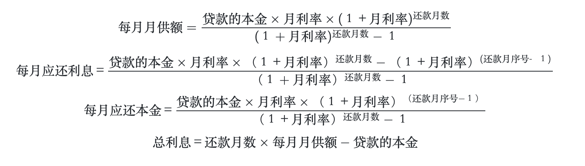

 English | [简体中文](README.md)

# housingloan-calc for China

  [](https://github.com/watership/housing-loan-calc/blob/master/LICENSE)

## Mathematical formula

### Equal principal and interest calculation method

Equal principal and interest: The principal and interest of the loan will be repaid in an equal amount each month, in which the principal is increased month by month, the interest is declining month by month, and the monthly repayment amount is unchanged.


### Equal principal calculation

Equal principal: The principal of the loan is repaid in an equal amount each month, in which the principal remains the same, the interest is decremented month by month, and the monthly repayment amount is less and less.


## How to use

Browser:

```html
<script src='path/to/housingloan-calc.js'></script>
```

[Node.js](http://nodejs.org):

```bash
$ npm install housingloan-calc
```

```javascript
const housingloanCalc = require('housingloan-calc');
```

ES6 module:

```javascript
import housingloanCalc from 'housingloan-calc';
const [loan, year, rate] = [100, 25, 4.9];

// 等额本息
const Result = housingloanCalc.fixCalc(loan, year, rate);

// 等额本金
const Result = housingloanCalc.capitalCalc(loan, year, rate);

const {
    type, // 类型
    loan, // 总贷款额
    total, // 总还款额
    interest, // 总利息
    months, // 贷款总月份数
    repaymentMonthly, // 每月月供额（等额本息） 或者 首月还款额（等额本金）
    incomeMonthly // 建议您的月收入流水必须需要大于数：流水要求：收入月流水 > 每月还款（月供） x 2
    monthlyData // 每月还款数额，仅等额本金方式时候有效
    } = Result;

monthlyData  = [
    {
    monthlyRepay: Number // 月供本金
    monthlyInterest:  Number // 月供利息
    monthlyAll: Number // 月供 = 月供本金 + 月供利息
    },
    {},
    {},
    {}
    ...
    ]

```

## Example

This is a QR code of WeChat Mini Program, you can scan code use WeChat.


## How to Contribute

Anyone and everyone is welcome to contribute to this project. The best way to start is by checking our[open issues](https://github.com/watership/housingLoanCalc/issues)、[submit a new issues](https://github.com/watership/housingLoanCalc/issues/new?labels=bug)or[feature request](https://github.com/watership/housingLoanCalc/issues/new?labels=enhancement),participate in discussions, upvote or downvote the issues you like or dislike.

## License

[**The MIT License**](LICENSE).